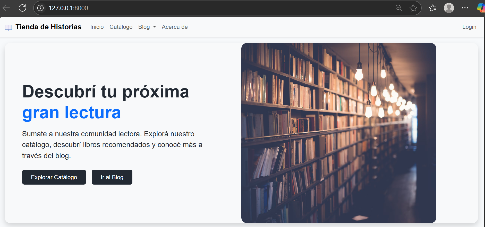
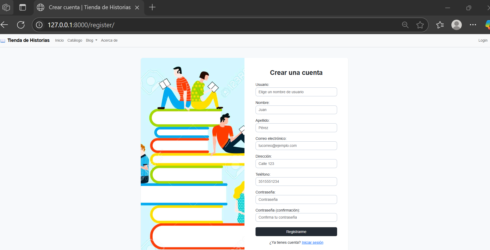
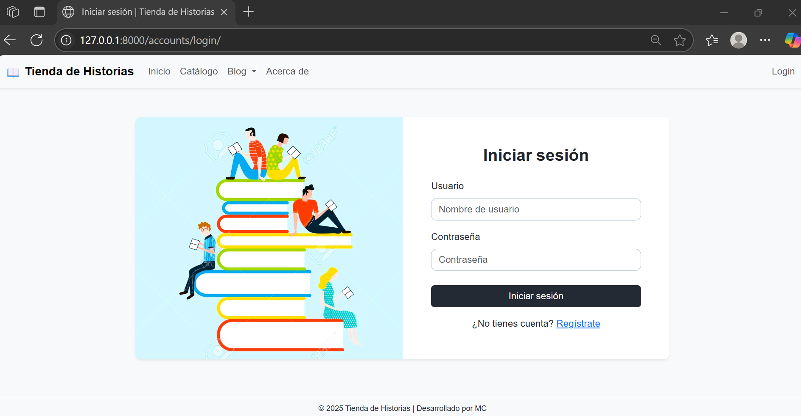
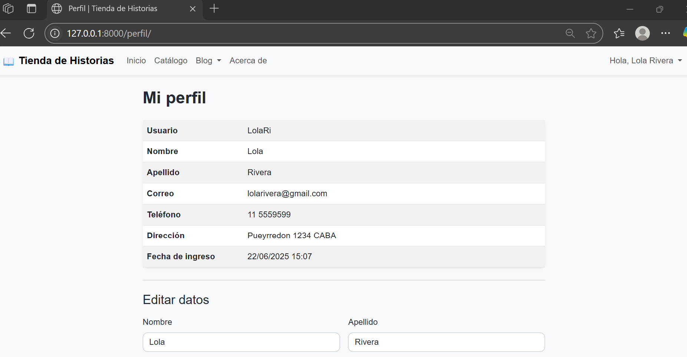
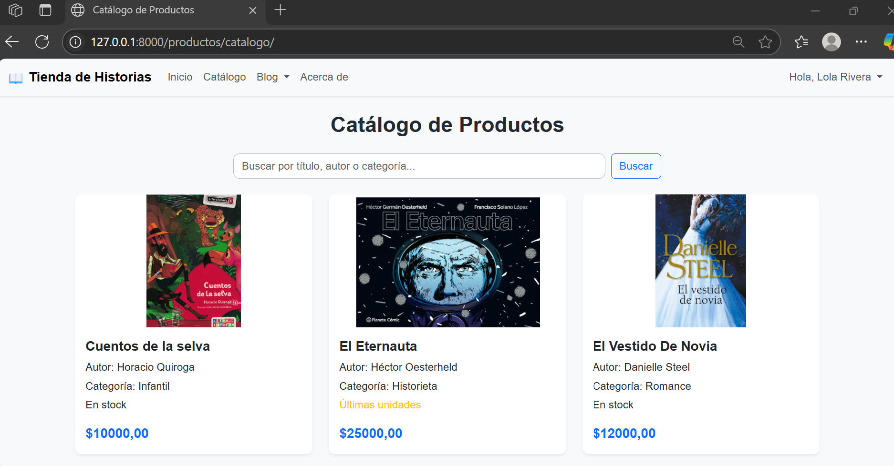
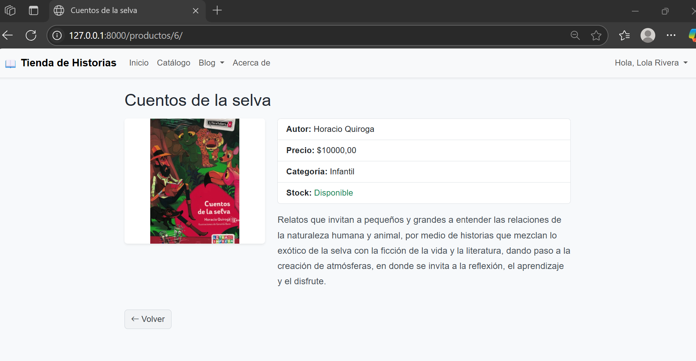
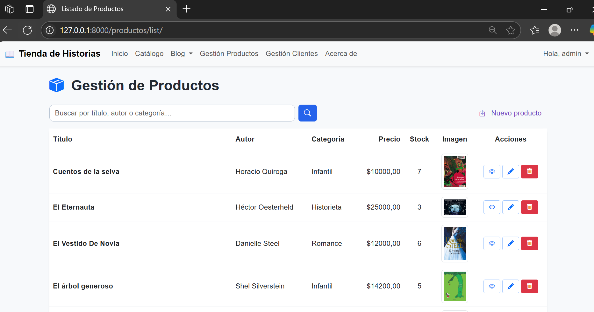
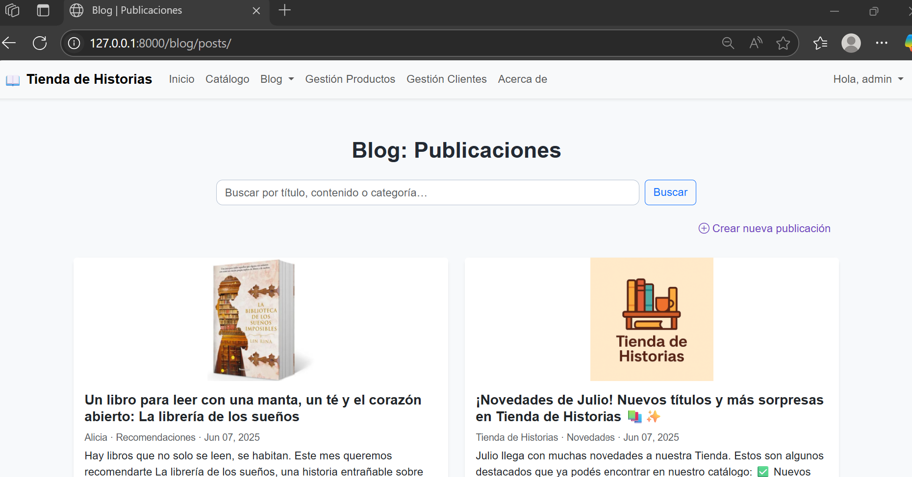
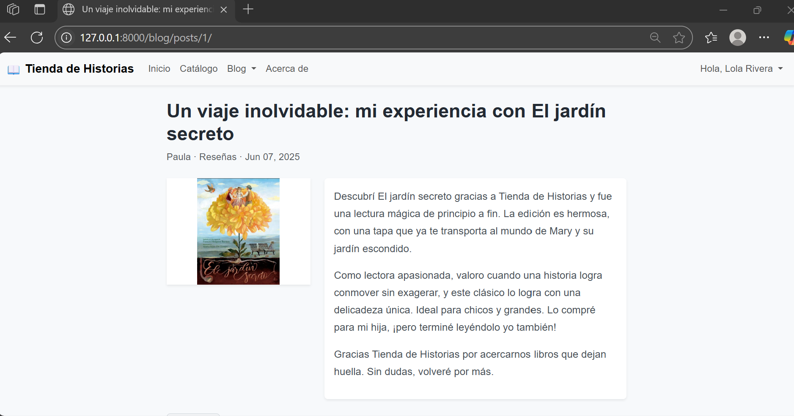

# Tienda de Historias 📚

Tienda de Historias es un portal literario desarrollado con Django 5.2 para la entrega final del curso Python / Django de Coderhouse.

Los visitantes pueden explorar un catálogo de libros, buscar por título, autor o categoría y sumarse a la comunidad lectora a través del blog, que requiere login para publicar.

El staff gestiona productos, clientes y blog desde la interfaz interna.

Por simplicidad académica no se incluyen carrito de compras ni pagos en línea; el foco está en la administración de contenidos y usuarios. 

---
## 🎬 Video demo
Subido a YouTube 👉 https://youtu.be/31paymYwBn0

---
## 🚀 Demo rápida

```bash
# 1️⃣ Crear y activar entorno virtual
python -m venv .venv && .venv\Scripts\activate  # Windows
# o: source .venv/bin/activate  # Linux/Mac

# 2️⃣ Instalar dependencias
pip install -r requirements.txt

# 3️⃣ Aplicar migraciones
python manage.py migrate

# 4️⃣ Crear superusuario (elige usuario y contraseña)
python manage.py createsuperuser

# 5️⃣ (Opcional) Cargar datos de ejemplo
python manage.py loaddata demo  # categorías, productos, posts, clientes

# 6️⃣ Levantar el servidor
python manage.py runserver  # abre http://127.0.0.1:8000/
```

---
## 🗂️ Apps y estructura

|    App      |                 Propósito                   | Modelos principales  |
|-------------|---------------------------------------------|----------------------|
| **core**    | Home, About, autenticación, perfiles        | `Profile`            |
| **client**  | Gestión de clientes (CRUD staff y auto)     | `Client`             |
| **product** | Catálogo y Gestión de productos (CRUD staff)| `Category`, `Product`|
| **blog**    | Publicación de posts                        | `Category`, `Post`   |

> Nota: Los modelos `Category` de `product` y `blog` son independientes.

---
## 🔑 Funcionalidades
- **Registro extendido** con e-mail, teléfono y dirección, sincronizando con modelo Cliente
- **Login / Logout** 
- **CRUD completo para staff** (productos, clientes, posts)
- **Catálogo público** con buscador y vista de detalle
- **Blog** con categorías y búsqueda (requiere login para publicar; edición/eliminación solo por autor o staff)
- **Perfil de usuario** editable (datos personales y contacto)
- **Internacionalización** (es-AR)
- **Subida de imágenes** (productos y posts)

---
## 🛤️ Rutas principales

Esta tabla resume las rutas principales para navegación y administración. Algunas están sujetas a permisos de usuario o roles específicos.

| Ruta base           | Descripción principal                        |
|---------------------|----------------------------------------------|
| `/`                 | Home, login, registro, perfil, about         |
| `/productos/`       | Catálogo, gestión y detalle de productos     |
| `/clientes/`        | Gestión de clientes (solo staff)             |
| `/blog/`            | Publicación y gestión de posts               |
| `/admin/`           | Panel de administración Django               |
| `/accounts/`        | Login/logout                                 |
| `/register/`        | Registro de usuario y cliente                |
| `/perfil/`          | Modificar perfil de usuario                  |


---
## 🛠️ Instalación detallada
1. **Clonar** el repo:
   ```bash
   git clone https://github.com/usuario/TiendaHistorias.git && cd TiendaHistorias
   ```
2. **Crear entorno** virtual y activar.
3. **Instalar** dependencias:
   ```bash
   pip install -r requirements.txt
   ```
4. **Crear base de datos** y aplicar migraciones:
   ```bash
   python manage.py migrate
   ```
5. **Cargar datos de prueba**:
   ```bash
   python manage.py loaddata demo       
   ```
6. **Levantar** el servidor:
   ```bash
   python manage.py runserver
   ```

### Variables opcionales (.env)
> En desarrollo no es obligatorio. Para producción, se recomienda usar variables de entorno.
| Variable | Descripción | Ejemplo |
|----------|-------------|---------|
| `DJANGO_SECRET_KEY` | Clave secreta en producción | `changeme` |
| `DEBUG` | 0 / 1 | `0` |

---
## 📂 Demo data (`fixtures/demo.json`)
Incluye:
- 3 categorías de producto
- 3 productos
- 2 posts de blog
- 2 usuarios cliente (alicia, pedro)

Cargar:
```bash
python manage.py loaddata demo
```

---
## 🖼️ Capturas de pantalla
<details>
  <summary>Home</summary>

  
</details>

<details>
  <summary>Registro, Login y Perfil </summary>

  
  
  
</details>

<details>
  <summary>Catálogo y productos</summary>

  
  
  
</details>

<details>
  <summary>Blog</summary>

  
  
</details>

<details>
  <summary>Gestión de clientes</summary>

  
</details>

---
## 🏗️ Stack técnico
- **Python 3.13**
- **Django 5.2.x**
- SQLite (dev) / PostgreSQL (sugerido en prod)
- Bootstrap 5
- Docker (opcional)
👉 El proyecto se centra en el desarrollo de backend con Django y utiliza tecnologías web modernas para la interfaz.

---
## 📜 Comandos útiles
| Acción |   Comando   |
|--------|-------------|
| Migrar | `python manage.py makemigrations && python manage.py migrate` |
| Crear superusuario | `python manage.py createsuperuser` |
| Tests | `python manage.py test` |
| Colectar estáticos | `python manage.py collectstatic` |

---
## 🏗️ Despliegue (resumen)
1. Preparar variables de entorno y DB PostgreSQL.
2. `python manage.py collectstatic --noinput`
3. Servir con Gunicorn + Nginx o plataforma preferida.

---
## 👩‍💻 Autor
**Marisa Canale**


